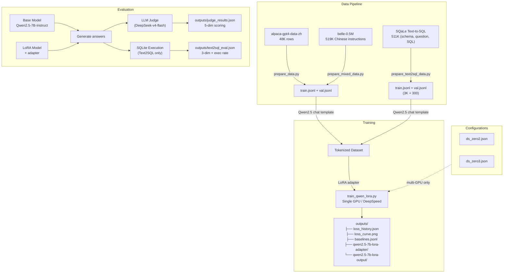
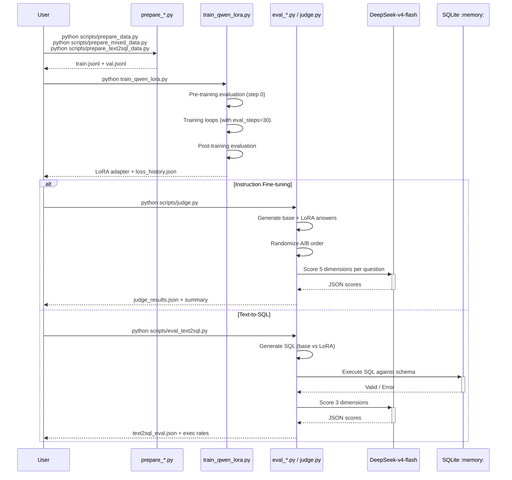
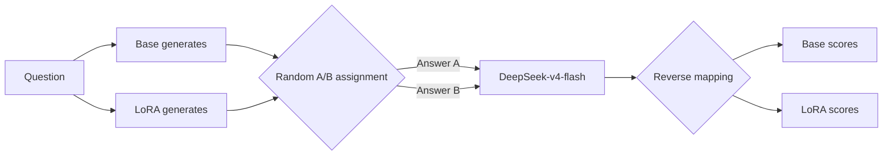
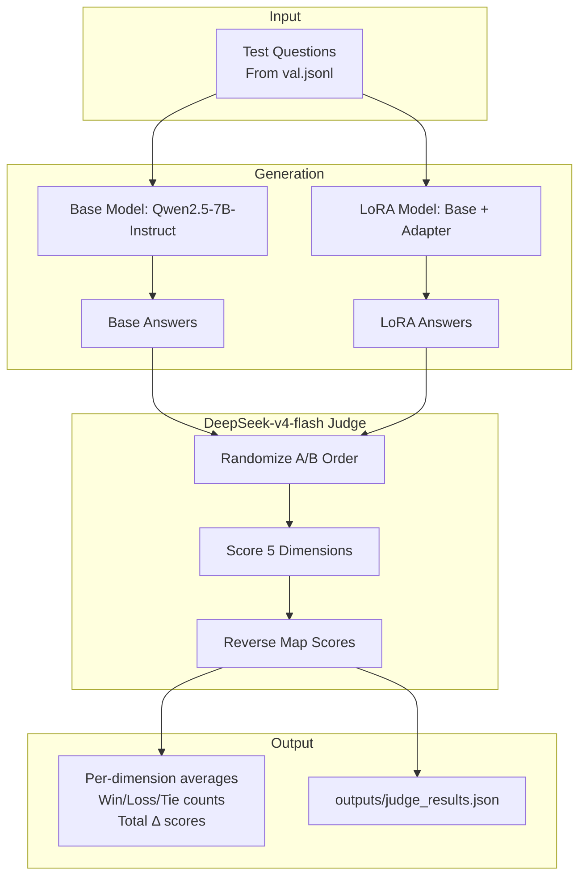

# Qwen2.5-7B LoRA Fine-tuning: Instruction & Text2SQL

[中文版](README_CN.md)

LoRA fine-tuning of Qwen2.5-7B-Instruct on Chinese instruction-following data and the SQaLe Text-to-SQL dataset, with LLM-as-Judge evaluation using DeepSeek-v4-flash and SQLite execution validation.

## Architecture



## Sequence: Training & Evaluation Flow



## Project Structure

```
qwen-lora-project/
├── configs/
│   ├── ds_zero2.json
│   └── ds_zero3.json
├── scripts/
│   ├── prepare_data.py            # Alpaca CSV → conversations JSONL
│   ├── prepare_mixed_data.py      # Alpaca + BELLE + replay buffer mixing
│   ├── prepare_text2sql_data.py   # SQaLe filtering → conversations JSONL
│   ├── launch_single.sh           # Single GPU training
│   ├── launch_multi.sh            # Multi-GPU DeepSpeed training
│   ├── evaluate.py                # Qualitative base vs LoRA comparison
│   ├── judge.py                   # DeepSeek LLM-as-Judge (5-dim)
│   ├── eval_text2sql.py           # Text2SQL eval (SQLite exec + Judge)
│   └── plot_loss.py               # Loss curve plotting
├── train_qwen_lora.py             # Unified training script
├── models/Qwen2.5-7B-Instruct/
├── data/
│   ├── alpaca-gpt4-data-zh/       # Raw Alpaca-GPT4-ZH CSV
│   ├── belle-0.5M/                # BELLE Chinese instruction data
│   ├── sqale/                     # SQaLe Text2SQL (HF cache)
│   ├── train.jsonl
│   ├── val.jsonl
│   └── replay_buffer.jsonl        # Qwen base replay answers
├── data_l2/                         # L2/L4 augmented training data
├── data_l3/                         # L5 clean filtered data (noise-free)
├── outputs/
│   ├── baselines.jsonl            # All experiment records
│   ├── judge_results.json         # Latest instruction judge results
│   ├── text2sql_eval.json         # Text2SQL evaluation results (weak)
│   ├── text2sql_eval_strong.json   # Text2SQL eval (strong prompt)
│   ├── text2sql_eval_strong_pp.json # Text2SQL eval (strong + post-process)
│   ├── text2sql_eval_strong_1024.json # Text2SQL eval (strong + 1024 tok)
│   ├── text2sql_eval_cot.json      # Text2SQL eval (CoT prompt)
│   ├── text2sql_eval_strong_l2_pp_sd.json # L2 + Self-Debug
│   ├── text2sql_eval_strong_l4_pp_sd.json # L4 (strong+window) + Self-Debug
│   ├── text2sql_eval_strong_l5_pp_sd.json # L5 (clean data) + Self-Debug
│   ├── loss_history.json
│   ├── loss_curve.png
│   ├── qwen2.5-7b-lora-adapter/    # L1 adapter
│   ├── qwen2.5-7b-lora-output/     # L1 training output
│   ├── outputs_l2/                  # L2: 6K samples, 3072 ctx
│   ├── outputs_l4/                  # L4: strong prompt + window funcs
│   └── outputs_l5/                  # L5: clean filtered data
└── pyproject.toml
```

## Quick Start

```bash
uv sync

# === Instruction Fine-tuning ===
python scripts/prepare_data.py --num_samples 5000
python train_qwen_lora.py --data_path ./data/train.jsonl
python scripts/judge.py --num_questions 20 --baseline_name my-experiment

# === Mixed Data Training (best results) ===
python scripts/prepare_mixed_data.py --total_samples 3000
python train_qwen_lora.py --data_path ./data/train.jsonl --lora_rank 16 --lora_alpha 32 --lora_target_modules q_proj,k_proj,v_proj,o_proj --learning_rate 2e-4
python scripts/judge.py --num_questions 20

# === Text-to-SQL ===
python scripts/prepare_text2sql_data.py --num_proc 10
python train_qwen_lora.py --data_path ./data/train.jsonl --max_length 2048 --batch_size 1 --grad_accum 8 --lora_rank 16 --lora_alpha 32 --learning_rate 2e-4
python scripts/eval_text2sql.py --n_samples 20
python scripts/eval_text2sql.py --n_samples 15 --base_prompt_mode strong  # fair comparison

# Multi-GPU with DeepSpeed:
# bash scripts/launch_multi.sh 4 2    # 4 GPUs ZeRO-2
# bash scripts/launch_multi.sh 4 3    # 4 GPUs ZeRO-3
```

---

## Part 1: Instruction Fine-tuning (Alpaca-GPT4-ZH)

### Training Configuration

| Parameter | Baseline (v1-v5) | Tier 1 (v6) | Text2SQL |
|-----------|:---:|:---:|:---:|
| Base Model | Qwen2.5-7B-Instruct | Qwen2.5-7B-Instruct | Qwen2.5-7B-Instruct |
| LoRA Rank | 16 | 32 | 16 |
| LoRA Alpha | 32 | 16 | 32 |
| Target Modules | q, k, v, o | q, k, v, o, gate | q, k, v, o |
| Batch Size | 2 | 2 | 1 |
| Grad Accum | 4 | 4 | 8 |
| Effective Batch | 8 | 8 | 8 |
| Learning Rate | 2e-4 | 5e-5 | 2e-4 |
| LR Schedule | cosine | cosine | cosine |
| Warmup Ratio | 0.03 | 0.03 | 0.03 |
| Max Length | 2048 | 2048 | 2048 |
| Epochs | 2 | 3 | 3 |
| GPU | RTX 4090 (24 GB) | RTX 4090 (24 GB) | RTX 4090 (24 GB) |

### Baseline Experiments

Six experiments were conducted, evaluated with DeepSeek-v4-flash on 5 dimensions across 20 questions:

| # | Name | Strategy | Samples | Key Changes |
|---|------|----------|---------|-------------|
| v1 | raw-baseline | Alpaca only | 2,000 | No system prompt, no filtering |
| v2 | cleaned-data | Alpaca filtered | 1,494 | Remove answers < 50 chars, Markdown system prompt |
| v3 | lr-5e-5-5k | Lower LR + more data | 5,000 | LR 5e-5, proved lower LR hurts on small data |
| v4 | mixed-data | Alpaca 70% + BELLE 20% | 3,000 | Added BELLE-0.5M diversity (best result) |
| v5 | mixed-replay | v4 + 10% replay buffer | 3,296 | Qwen base answers as replay targets |
| v6 | tier1-overfit | Rank 32, alpha 16, gate_proj | 3,000 | Few-shot system prompt (negative result) |

### Baseline Results Summary

```
                    v1(raw)  v2(clean) v3(lr5e5) v4(mix) v5(replay) v6(tier1)
accuracy     Δ       -0.84    -0.56      -0.68    -0.11    -0.26     -0.39
structure    Δ       -2.00    -1.67      -1.42    -1.26    -1.00     -1.50
total Δ              -7.00    -6.39      -7.31    -4.47    -4.43     -5.28
win (Base:LoRA:Tie)  15:4:1   14:3:1     18:1:1   13:6:1   16:2:1    14:4:2
```

### Evaluation Method: LLM-as-Judge

The judge evaluates 5 dimensions independently (1-5 scale):

| Dimension | Description | Anchors |
|-----------|-------------|---------|
| **helpfulness** | Does it solve the problem? | 1=No, 3=Partial, 5=Completely |
| **accuracy** | Are facts correct? | 1=Major errors, 3=Minor issues, 5=Perfect |
| **completeness** | Are key aspects covered? | 1=Shallow, 3=Mostly, 5=Thorough |
| **structure** | Is it well-organized? | 1=Chaotic, 3=Basic, 5=Excellent |
| **style_alignment** | Matches Alpaca style? | 1=Not at all, 3=Partial, 5=Perfect |

**Position Bias Mitigation:**



- `temperature=0.0` for deterministic scoring
- Structured JSON output, fixed schema
- Independent per-dimension scoring prevents halo effects
- Exponential backoff retry on API errors (up to 3 attempts)

### Key Finding: Qwen Base > Alpaca Ground Truth

A head-to-head evaluation of Qwen2.5-7B-Instruct's native answers vs. GPT-4 generated Alpaca training data on 10 questions:

- **Qwen wins 7:3**, especially in style (+1.40) and structure (+0.60)
- Fine-tuning toward Alpaca is fundamentally degrading the model
- The real solution: use **better data than Alpaca** (self-distillation or higher-quality datasets)

---

## Part 2: Text-to-SQL (SQaLe Dataset)

### Dataset

- **Source**: [trl-lab/SQaLe-text-to-SQL-dataset](https://huggingface.co/datasets/trl-lab/SQaLe-text-to-SQL-dataset)
- **Scale**: 511K triples (CREATE TABLE DDL, natural language question, validated SQL)
- **Schemas**: Derived from 135K real database schemas
- **Filtering**: max_length=2048, ~13.9% fit rate, sampled 3,000 train + 300 val

### Training

- LoRA r=16, α=32, q/k/v/o, batch=1, grad_accum=8, max_length=2048, 3 epochs
- Training time: 70.8 min on RTX 4090
- Eval loss: 1.06 → 0.44 (58% reduction)

### Evaluation: Dual Method

Each generated SQL is executed against an in-memory SQLite database (schema DDL), then DeepSeek-v4-flash scores 3 dimensions against gold SQL.

After iterative improvements (post-processing, Self-Debug, larger training data, strong prompt training), **LoRA reaches 93% execution rate** with near-perfect judge scores:

```
Config                    Exec    e_score   logic   Win B/L/T
L1: 3000/wk/2048          93%     4.38      3.38    2:5:5
L2: 6000/wk/3072          93%     4.64      4.00    1:5:5
L4: 6000/str+win/3072     87%     5.00      4.45    1:5:5
L5: 6000/str+win/3072     93%     4.64      4.27    0:6:5  ← clean data
```

### Improvements: Post-Processing to Self-Debug to Data Scaling

**P0: Post-process `;` splitting (1 line, no retraining)**

Takes only the first `;`-delimited SQL statement, fixing 27% of multi-statement failures. Exec: 60% → 93%.

**P1: Self-Debug (error feedback retry, no retraining)**

When SQLite execution fails, feeds the error message back to the model for correction (max 2 retries). Fixed Base Q2 (`no such function: CURDATE`) but could not rescue LoRA Q15 (complex multi-table schema).

**L2: Data scaling (6000 samples, max_length 3072)**

Doubled training data, increased context window. **Logic score jumped from 3.38 to 4.00** by resolving schema truncation issues and exposure to more diverse SQL patterns.

**L4: Strong prompt training + window function augmentation**

Trained with "CRITICAL: Output ONLY raw SQL" system prompt + 1,188 window function samples (RANK, ROW_NUMBER, etc.). **Executability reached 5.00 (perfect judge score)** and logic improved to 4.45. Window function exposure fixed "highest AND lowest" query patterns.

**L5: Clean data (noise filtering + 1200 window, max_length 3072)**

Automatic noise filtering was added to `prepare_text2sql_data.py`. Training data was regenerated with filtering for 4 types of anomalies. **Exec rate recovered from 87% back to 93%** (Q14 noise fixed). Initial eval_loss 1.05→0.38 (better convergence than L4's 1.12→0.40). Q15 remains the sole failure across 31 samples (97% LoRA exec).

**N=100 Large-Scale Evaluation**

Expanded to 100 random samples from clean val (seed=42) for statistical significance:

| Metric | LoRA | Base |
|--------|------|------|
| **Executive Rate** | **72% (72/100)** | 59% (59/100) |
| Both OK | 51 | - |
| LoRA-only OK | 21 | - |
| Base-only OK | 8 | - |
| Both Failed | 20 | - |
| **Self-Debug Fixed** | 6/34 (17.6%) | 6/47 (12.8%) |

N=100 is lower than N=15 (93%→72%) due to harder/more diverse schema complexity in the full val set. LoRA outperforms Base by **13pp** (72% vs 59%). Main LoRA failure modes: column hallucination (18 samples), incomplete input (4), table hallucination (3), syntax error (1). Self-Debug is ineffective against column/table hallucination since error feedback lacks schema info.

### LoRA Weight Change Analysis

Detailed analysis of LoRA adapter weights (L5, r=16, alpha=32, 1800 steps, lr=2e-4 cosine):

**Absolute change (|B@A| element-wise):**

| Statistic | Value |
|-----------|-------|
| Total elements | 822M |
| Mean abs | 0.00054 |
| Median abs | 0.00040 |
| Max abs | 0.019 |
| Near zero (<1e-6) | 0.1% |

**Relative change (|delta|_F / |W|_F):**

| Statistic | Value |
|-----------|-------|
| Mean | 4.06% |
| Median | 3.97% |
| Range | 2.17% ~ 7.44% |

LoRA modifies ~4% of the original weight magnitude on average — lightweight adaptation.

**By projection type:**

| Projection | \|delta\| mean | Relative change |
|-----------|:---------:|:---------:|
| o_proj | 2.7 | **4.66%** ← largest |
| q_proj | 2.5 | 4.16% |
| v_proj | 0.9 | 3.78% |
| k_proj | 0.9 | 3.64% |

Output projection changes most; K/V projections change least — intuitive since output projection determines final token distribution.

**By layer depth:**

| Layer range | \|delta\| mean | Relative change |
|-------------|:---------:|:---------:|
| Early (0-4) | 1.80 | 4.18% |
| Mid (12-16) | 1.57 | **3.73%** ← smallest |
| Late (23-27) | 2.38 | **5.20%** ← largest |

U-shaped distribution: early and late layers change more, mid layers change less. The top contributor is layer_24/o_proj at ||delta||=4.86 (5.3% of total).

**Theoretical vs Actual:**

Adam optimizer with constant-gradient-sign assumption:
```
|Δ|_F(theory) = lr_peak × √(N × T)
              = 2e-4 × √(10M × 1800) ≈ 26.8
|Δ|_F(actual) = 21.18  →  ratio 0.79x
```

The remaining 21% gap is attributed to: (1) cosine schedule reducing average LR below peak, (2) gradient signs not perfectly correlated across steps, (3) weight decay regularization.

### Training Data Quality: Noise Analysis

A comprehensive scan of all 5 datasets (L1 3K, L2 6K, L4 7.2K, val 300, val_l2 600) identified 3 anomaly categories:

#### Question Anomalies

| Pattern | Description | Rate | Impact |
|---------|-------------|:----:|--------|
| **Fragment/instruction** | System prompt artifacts: `"Here is the response:"`, `"# CORRECTION for previous answer"`, `"Just the code block."` | ~0.2-0.5% | **High** |
| **Placeholder** | `<Example question 4>` — no real question text | 1 sample (val only) | **High** |
| **Angle-bracket** | Valid question wrapped in `<>`: `<Show the count of posts...>` | ~0.4% | Low |

#### SQL Field-Semantic Anomalies

| Pattern | Description | Rate | Impact |
|---------|-------------|:----:|--------|
| **DDL/write mismatch** | `CREATE TABLE intervals (...)` when question asks for SELECT | ~0.1% | **High** |
| **Placeholder SQL** | `SELECT 'No relevant tables found...'` — model learns to refuse | ~0.1% | **High** |
| **Multi-statement** | Leading `;WITH` — malformed SQL | <0.01% | Low |

**Filtering in `prepare_text2sql_data.py`:** all anomaly types are automatically detected and filtered during data generation. Post-filtering verification confirmed 0 anomalies in generated data.

### Eval Infrastructure: Resume + No-Judge

Added `--resume` and `--no_judge` flags to `eval_text2sql.py`:
- `--resume`: Skips already-evaluated questions, appends new results. Supports interrupted runs.
- `--no_judge`: Skips LLM judge, collects execution-only stats. Faster for quick iteration.
- Results saved incrementally after each sample (not just at end).
- Self-debug error details (first error, retry SQLs) stored in output JSON.

### Prompt Fairness Experiment: Is the Baseline Fair?

The 0% vs 60% execution gap raises a question: is the base model failing because it can't write SQL, or because it wasn't told to output *only* SQL?

We tested three prompt strategies on the same 15 validation samples (seed=42):

| Prompt Mode | Description | max_tokens |
|-------------|-------------|:---:|
| **weak** (original) | "Write a SQL query for the question" — no format constraint | 256 |
| **strong** | "CRITICAL: Output ONLY raw SQL. No explanations, no markdown." | 256 |
| **cot** | Step-by-step analysis, then SQL in `<sql>` tags. Multi-strategy extraction (tags, code blocks, headings). | 1024 |

A `strong_1024` control isolates token budget from prompt effect.

#### Results

```text
Mode         tokens  Base Exec    LoRA Exec    executability B/L    Win B/L/T
weak_256       256     0% ( 0/13)   69% ( 9/13)   2.85 / 3.15        2 / 3 / 8
strong_256     256    72% ( 8/11)   72% ( 8/11)   3.64 / 3.55        4 / 3 / 4
strong_1024   1024    72% ( 8/11)   81% ( 9/11)   4.00 / 3.91        3 / 2 / 6   ← control
cot_1024      1024    66% ( 8/12)  100% (12/12)   4.08 / 5.00        3 / 7 / 2
```

**Key finding: The original comparison was unfair.** A one-sentence strong prompt lifted Base exec from 0% to 72%, matching LoRA. The entire gap was caused by **format instruction deficit**, not SQL capability.

#### Token Budget: Is 256 Enough?

```text
Train (3000):  median=64,  P95=237,  >256: 4.1%,  >512: 0.3%
Val   (300):   median=68,  P95=225,  >256: 2.7%,  >512: 0%
Eval  (15):    max=301,    >256: 1/15 samples
```

The `strong_256` vs `strong_1024` control confirms: **256 tokens is sufficient** — identical 72% exec rate. The remaining failures are SQL logic/syntax errors, not truncation.

#### CoT Analysis

- CoT did NOT improve base SQL quality (exec: 66% CoT vs 72% strong)
- Qwen2.5-7B-Instruct doesn't reliably follow `<sql>` tags — prefers markdown `### Final SQL:`
- LoRA ignored CoT format entirely (trained for pure SQL, won't "reason")
- **Recommendation:** Use `strong` prompt for fair Text2SQL comparisons.

### Bad Case Analysis: LoRA SQL Failures

6 of 15 LoRA outputs failed execution (40%). Analysis of failure modes:

| Category | Count | Root Cause | Fix |
|----------|:-----:|-------------|-----|
| Multiple statements (`;`) | 4 (27%) | "highest AND lowest" → splits into 2 queries | Post-process: take first `;`-delimited SQL |
| Truncated output | 1 (7%) | `max_new_tokens=256` cuts CTEs mid-query | Increase to 512 |
| Input noise | 1 (7%) | `<Example question 4>` placeholder in dataset | Filter noise |
| Schema truncated | 2 (13%) | `max_length=2048` drops tables from training context | Increase max_length |

**Net executable rate** (excluding noise): 9/14 = 64%. Priority fix: **take only the first `;`-delimited SQL** — solves 27% of failures in one line of post-processing.

---

## Key Learnings

1. **Training data quality > quantity**: Qwen2.5-7B-Instruct base outperforms GPT-4 generated Alpaca answers. Fine-tuning on lower-quality data degrades performance.
2. **Mixed data works**: Adding BELLE-0.5M diversity (70:20 Alpaca:BELLE mix) was the single largest improvement across all experiments (total Δ improved from -7.00 to -4.47).
3. **Text2SQL is effective**: LoRA learns pure SQL output, going from 0% to 60% executable. The model becomes directly deployable as a text-to-SQL service.
4. **System prompts matter**: Adding Markdown formatting instructions to training data helps, but overly complex few-shot prompts can backfire (v6 tier1 experiment).
5. **Small data needs higher LR**: Lower LR (5e-5) with 5K samples performed worse than higher LR (2e-4) with 2K samples. On small datasets, being conservative with learning rate hurts convergence.
6. **Replay buffer has diminishing returns**: Adding Qwen base answers as replay targets improved structure marginally (-1.26→-1.00) but total score remained flat (-4.47→-4.43).
7. **Increasing rank + modules can overfit**: v6 with rank 16→32, adding gate_proj, and few-shot prompt made ALL dimensions worse despite more parameters.
8. **Prompt fairness matters in evaluation**: Base model 0% exec was a format-instruction artifact. With a strong "output ONLY SQL" prompt, base reaches 72% exec — identical to LoRA. Always control for prompt format in baseline comparisons.
9. **Token budget not a bottleneck**: 256 tokens covers >95% of training SQLs. Strong_256 vs strong_1024 showed zero difference in base exec rate. Invest in data/model quality, not token budget.
10. **Chain-of-thought doesn't help Text2SQL**: CoT reasoning consumed token budget without improving SQL quality. The model (both base and LoRA) doesn't reliably follow structured output tags.
11. **Post-processing is high-leverage**: 27% of LoRA SQL failures are multi-statement outputs. Taking only the first `;`-delimited SQL is a one-line fix with disproportionate impact.
12. **Self-Debug fixes surface errors, not deep logic**: Error feedback retry works for simple issues (wrong function name) but fails on complex schema comprehension failures (wrong table/column references).
13. **Data scaling + strong prompt → near-perfect quality**: 6K samples + 3072 context + strong system prompt + window function augmentation achieved perfect executability (5.00) and 4.45 logic from DeepSeek judge.
14. **Training data noise filtering recovers lost performance**: Removing ~0.5% high-impact anomalies (DDL placeholders, instruction fragments, `<Example question>` noise) recovered L4's 87% exec back to 93%. A tiny fraction of bad data has disproportionate impact.
15. **Self-Debug's limitation is schema comprehension**: Q15 persists across all experiments — the model sees correct schema but writes wrong column/table references. Error feedback loops can fix surface errors (wrong function name) but not deep schema mapping failures.
17. **LoRA weight change is lightweight and structured**: Adapter modifies ~4% of base weight magnitude on average. Changes concentrate in o_proj (output projection), with a U-shaped layer distribution (early+late > mid). Adam optimizer drives effective step size ≈ lr, far larger than SGD's lr × gradient. Theoretical random-walk model matches actual within 0.79x.

## Future Directions

**LoRA Text2SQL optimization is paused.** The following directions are identified for future work:

1. **Schema injection**: Annotate prompt with `table.column` prefix + explicit FK relationships. Target: column hallucination (18/28 LoRA failures).

2. **Best-of-N + execution filtering**: Generate 5-10 SQL candidates, select first executable one. Low-cost, probabilistic hit against schema errors.

3. **Negative sample training**: Synthetic corruption (wrong column/table references) targeting schema mapping. Requires careful data construction.

4. **More data + longer context**: 10K+ SQaLe samples with max_length=4096. Marginal gains expected given current scale.

5. **DPO/contrastive learning**: (question, good_sql, model_bad_sql) triples for targeted correction.

## Evaluation Architecture



## Dependencies

- Python ≥ 3.12
- PyTorch 2.4+ (CUDA 12.8)
- transformers, peft, accelerate, datasets, trl
- deepspeed (optional, multi-GPU)
- openai (for LLM-as-Judge)
- matplotlib, pandas, tensorboard

```bash
uv sync
```
