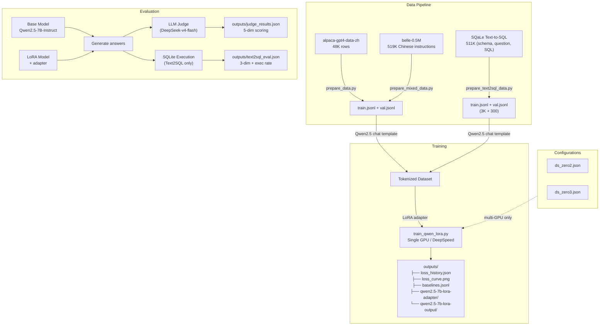
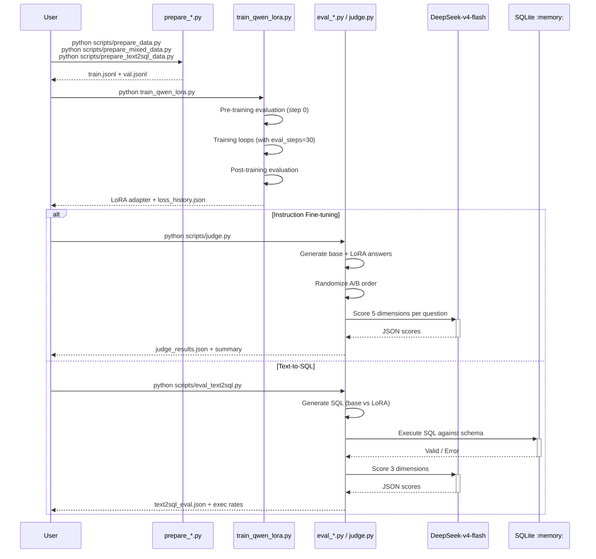
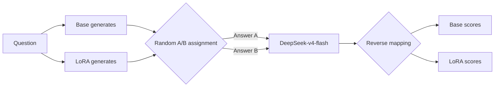
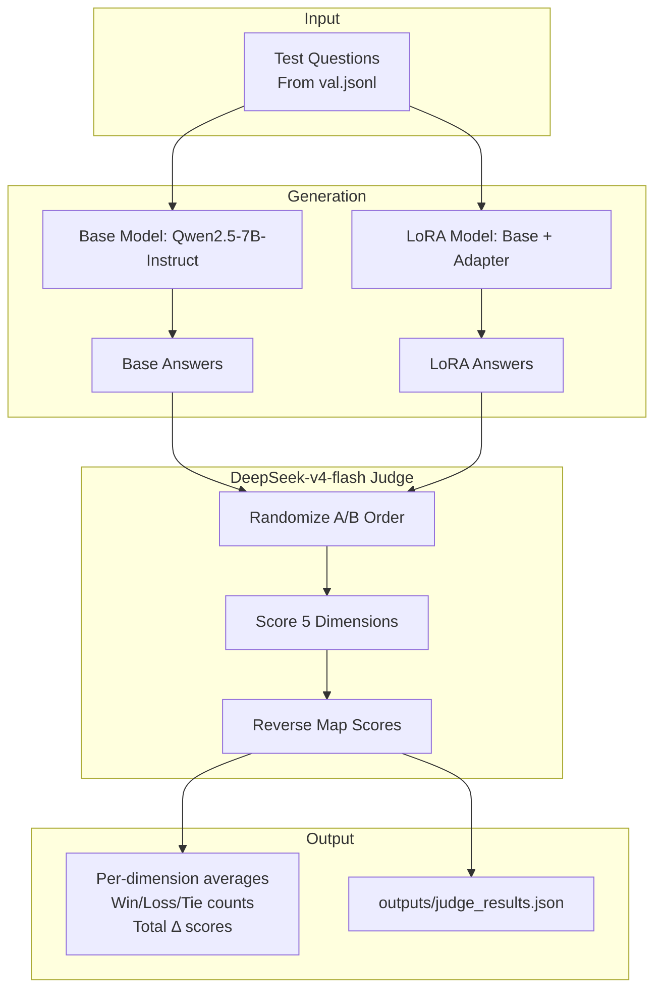

# Qwen2.5-7B LoRA Fine-tuning: Instruction & Text2SQL

[中文版](README_CN.md)

LoRA fine-tuning of Qwen2.5-7B-Instruct on Chinese instruction-following data and the SQaLe Text-to-SQL dataset, with LLM-as-Judge evaluation using DeepSeek-v4-flash and SQLite execution validation.

## Architecture



## Sequence: Training & Evaluation Flow



## Project Structure

```
qwen-lora-project/
├── configs/
│   ├── ds_zero2.json
│   └── ds_zero3.json
├── scripts/
│   ├── prepare_data.py            # Alpaca CSV → conversations JSONL
│   ├── prepare_mixed_data.py      # Alpaca + BELLE + replay buffer mixing
│   ├── prepare_text2sql_data.py   # SQaLe filtering → conversations JSONL
│   ├── launch_single.sh           # Single GPU training
│   ├── launch_multi.sh            # Multi-GPU DeepSpeed training
│   ├── evaluate.py                # Qualitative base vs LoRA comparison
│   ├── judge.py                   # DeepSeek LLM-as-Judge (5-dim)
│   ├── eval_text2sql.py           # Text2SQL eval (SQLite exec + Judge)
│   └── plot_loss.py               # Loss curve plotting
├── train_qwen_lora.py             # Unified training script
├── models/Qwen2.5-7B-Instruct/
├── data/
│   ├── alpaca-gpt4-data-zh/       # Raw Alpaca-GPT4-ZH CSV
│   ├── belle-0.5M/                # BELLE Chinese instruction data
│   ├── sqale/                     # SQaLe Text2SQL (HF cache)
│   ├── train.jsonl
│   ├── val.jsonl
│   └── replay_buffer.jsonl        # Qwen base replay answers
├── outputs/
│   ├── baselines.jsonl            # All experiment records
│   ├── judge_results.json         # Latest instruction judge results
│   ├── text2sql_eval.json         # Text2SQL evaluation results
│   ├── loss_history.json
│   ├── loss_curve.png
│   ├── qwen2.5-7b-lora-adapter/
│   └── qwen2.5-7b-lora-output/
└── pyproject.toml
```

## Quick Start

```bash
uv sync

# === Instruction Fine-tuning ===
python scripts/prepare_data.py --num_samples 5000
python train_qwen_lora.py --data_path ./data/train.jsonl
python scripts/judge.py --num_questions 20 --baseline_name my-experiment

# === Mixed Data Training (best results) ===
python scripts/prepare_mixed_data.py --total_samples 3000
python train_qwen_lora.py --data_path ./data/train.jsonl --lora_rank 16 --lora_alpha 32 --lora_target_modules q_proj,k_proj,v_proj,o_proj --learning_rate 2e-4
python scripts/judge.py --num_questions 20

# === Text-to-SQL ===
python scripts/prepare_text2sql_data.py --num_proc 10
python train_qwen_lora.py --data_path ./data/train.jsonl --max_length 2048 --batch_size 1 --grad_accum 8 --lora_rank 16 --lora_alpha 32 --learning_rate 2e-4
python scripts/eval_text2sql.py --n_samples 20

# Multi-GPU with DeepSpeed:
# bash scripts/launch_multi.sh 4 2    # 4 GPUs ZeRO-2
# bash scripts/launch_multi.sh 4 3    # 4 GPUs ZeRO-3
```

---

## Part 1: Instruction Fine-tuning (Alpaca-GPT4-ZH)

### Training Configuration

| Parameter | Baseline (v1-v5) | Tier 1 (v6) | Text2SQL |
|-----------|:---:|:---:|:---:|
| Base Model | Qwen2.5-7B-Instruct | Qwen2.5-7B-Instruct | Qwen2.5-7B-Instruct |
| LoRA Rank | 16 | 32 | 16 |
| LoRA Alpha | 32 | 16 | 32 |
| Target Modules | q, k, v, o | q, k, v, o, gate | q, k, v, o |
| Batch Size | 2 | 2 | 1 |
| Grad Accum | 4 | 4 | 8 |
| Effective Batch | 8 | 8 | 8 |
| Learning Rate | 2e-4 | 5e-5 | 2e-4 |
| LR Schedule | cosine | cosine | cosine |
| Warmup Ratio | 0.03 | 0.03 | 0.03 |
| Max Length | 2048 | 2048 | 2048 |
| Epochs | 2 | 3 | 3 |
| GPU | RTX 4090 (24 GB) | RTX 4090 (24 GB) | RTX 4090 (24 GB) |

### Baseline Experiments

Six experiments were conducted, evaluated with DeepSeek-v4-flash on 5 dimensions across 20 questions:

| # | Name | Strategy | Samples | Key Changes |
|---|------|----------|---------|-------------|
| v1 | raw-baseline | Alpaca only | 2,000 | No system prompt, no filtering |
| v2 | cleaned-data | Alpaca filtered | 1,494 | Remove answers < 50 chars, Markdown system prompt |
| v3 | lr-5e-5-5k | Lower LR + more data | 5,000 | LR 5e-5, proved lower LR hurts on small data |
| v4 | mixed-data | Alpaca 70% + BELLE 20% | 3,000 | Added BELLE-0.5M diversity (best result) |
| v5 | mixed-replay | v4 + 10% replay buffer | 3,296 | Qwen base answers as replay targets |
| v6 | tier1-overfit | Rank 32, alpha 16, gate_proj | 3,000 | Few-shot system prompt (negative result) |

### Baseline Results Summary

```
                    v1(raw)  v2(clean) v3(lr5e5) v4(mix) v5(replay) v6(tier1)
accuracy     Δ       -0.84    -0.56      -0.68    -0.11    -0.26     -0.39
structure    Δ       -2.00    -1.67      -1.42    -1.26    -1.00     -1.50
total Δ              -7.00    -6.39      -7.31    -4.47    -4.43     -5.28
win (Base:LoRA:Tie)  15:4:1   14:3:1     18:1:1   13:6:1   16:2:1    14:4:2
```

### Evaluation Method: LLM-as-Judge

The judge evaluates 5 dimensions independently (1-5 scale):

| Dimension | Description | Anchors |
|-----------|-------------|---------|
| **helpfulness** | Does it solve the problem? | 1=No, 3=Partial, 5=Completely |
| **accuracy** | Are facts correct? | 1=Major errors, 3=Minor issues, 5=Perfect |
| **completeness** | Are key aspects covered? | 1=Shallow, 3=Mostly, 5=Thorough |
| **structure** | Is it well-organized? | 1=Chaotic, 3=Basic, 5=Excellent |
| **style_alignment** | Matches Alpaca style? | 1=Not at all, 3=Partial, 5=Perfect |

**Position Bias Mitigation:**



- `temperature=0.0` for deterministic scoring
- Structured JSON output, fixed schema
- Independent per-dimension scoring prevents halo effects
- Exponential backoff retry on API errors (up to 3 attempts)

### Key Finding: Qwen Base > Alpaca Ground Truth

A head-to-head evaluation of Qwen2.5-7B-Instruct's native answers vs. GPT-4 generated Alpaca training data on 10 questions:

- **Qwen wins 7:3**, especially in style (+1.40) and structure (+0.60)
- Fine-tuning toward Alpaca is fundamentally degrading the model
- The real solution: use **better data than Alpaca** (self-distillation or higher-quality datasets)

---

## Part 2: Text-to-SQL (SQaLe Dataset)

### Dataset

- **Source**: [trl-lab/SQaLe-text-to-SQL-dataset](https://huggingface.co/datasets/trl-lab/SQaLe-text-to-SQL-dataset)
- **Scale**: 511K triples (CREATE TABLE DDL, natural language question, validated SQL)
- **Schemas**: Derived from 135K real database schemas
- **Filtering**: max_length=2048, ~13.9% fit rate, sampled 3,000 train + 300 val

### Training

- LoRA r=16, α=32, q/k/v/o, batch=1, grad_accum=8, max_length=2048, 3 epochs
- Training time: 70.8 min on RTX 4090
- Eval loss: 1.06 → 0.44 (58% reduction)

### Evaluation: Dual Method

**1. SQLite Execution (objective):**

Each generated SQL is executed against an in-memory SQLite database created from the schema DDL:

```
Base Model: 0% executable  (outputs explanatory text + SQL in markdown blocks)
LoRA Model: 60% executable (learns pure SQL output)
```

**2. DeepSeek Judge (subjective):**

3-dimension scoring with reference gold SQL:

```
Dimension             Base    LoRA    Δ
executability           --      --   +0.31
logical_correctness     --      --   +0.23
conciseness             --      --   +0.23
Win: Base=2, LoRA=3, Tie=8 / 13 evaluated
```

---

## Key Learnings

1. **Training data quality > quantity**: Qwen2.5-7B-Instruct base outperforms GPT-4 generated Alpaca answers. Fine-tuning on lower-quality data degrades performance.
2. **Mixed data works**: Adding BELLE-0.5M diversity (70:20 Alpaca:BELLE mix) was the single largest improvement across all experiments (total Δ improved from -7.00 to -4.47).
3. **Text2SQL is effective**: LoRA learns pure SQL output, going from 0% to 60% executable. The model becomes directly deployable as a text-to-SQL service.
4. **System prompts matter**: Adding Markdown formatting instructions to training data helps, but overly complex few-shot prompts can backfire (v6 tier1 experiment).
5. **Small data needs higher LR**: Lower LR (5e-5) with 5K samples performed worse than higher LR (2e-4) with 2K samples. On small datasets, being conservative with learning rate hurts convergence.
6. **Replay buffer has diminishing returns**: Adding Qwen base answers as replay targets improved structure marginally (-1.26→-1.00) but total score remained flat (-4.47→-4.43).
7. **Increasing rank + modules can overfit**: v6 with rank 16→32, adding gate_proj, and few-shot prompt made ALL dimensions worse despite more parameters.

## Evaluation Architecture



## Dependencies

- Python ≥ 3.12
- PyTorch 2.4+ (CUDA 12.8)
- transformers, peft, accelerate, datasets, trl
- deepspeed (optional, multi-GPU)
- openai (for LLM-as-Judge)
- matplotlib, pandas, tensorboard

```bash
uv sync
```
