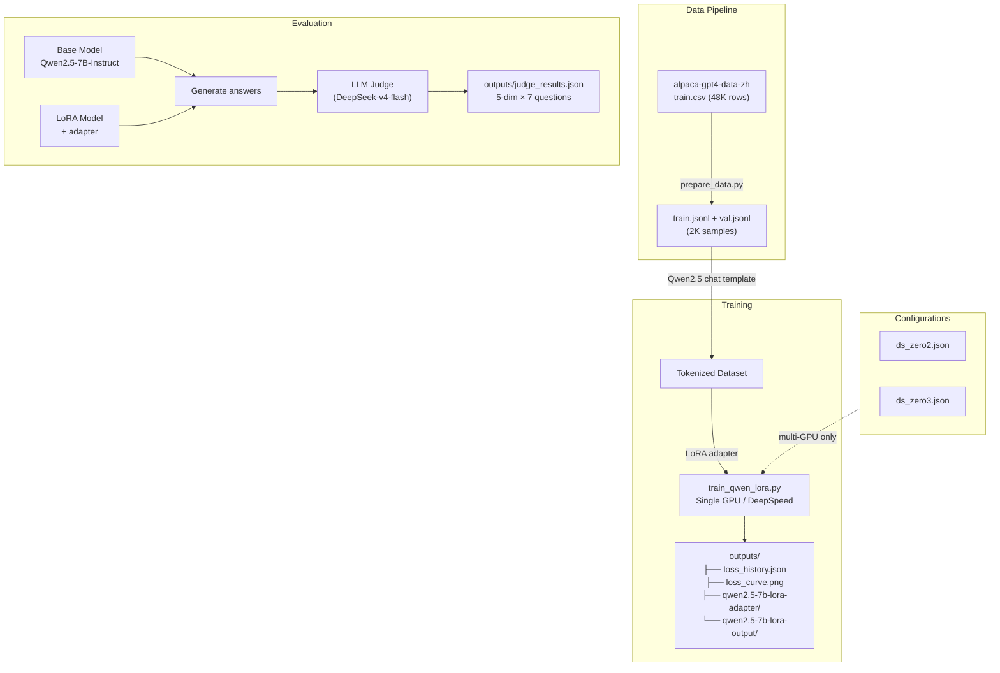
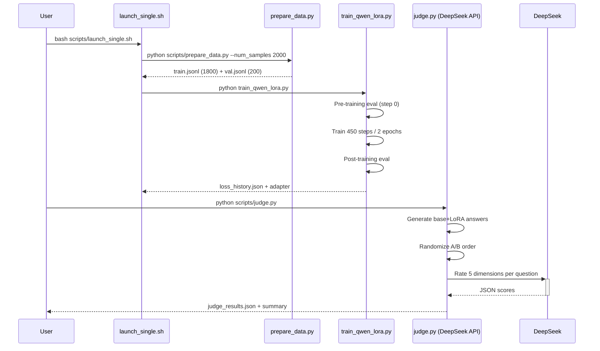
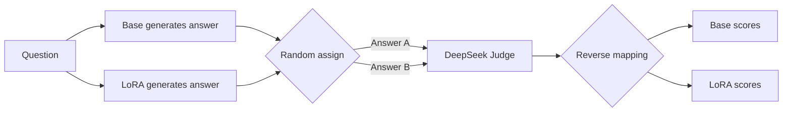

# Qwen2.5-7B LoRA Fine-tuning & Evaluation

[中文版](README_CN.md)

LoRA fine-tuning of Qwen2.5-7B-Instruct on Chinese instruction-following data (Alpaca-GPT4-ZH), with LLM-as-Judge evaluation using DeepSeek-v4-flash.

## Architecture



## Sequence: Training & Evaluation Flow



## Project Structure

```
qwen-lora-project/
├── configs/
│   ├── ds_zero2.json              # DeepSpeed ZeRO-2 config
│   └── ds_zero3.json              # DeepSpeed ZeRO-3 config
├── scripts/
│   ├── prepare_data.py            # CSV → conversations JSONL
│   ├── launch_single.sh           # Single GPU training
│   ├── launch_multi.sh            # Multi-GPU DeepSpeed training
│   ├── evaluate.py                # Qualitative base vs LoRA comparison
│   ├── judge.py                   # DeepSeek LLM-as-Judge evaluation
│   └── plot_loss.py               # Loss curve plotting
├── train_qwen_lora.py             # Unified training script
├── models/
│   └── Qwen2.5-7B-Instruct/      # Base model (~15 GB)
├── data/
│   ├── alpaca-gpt4-data-zh/      # Raw Alpaca-GPT4-ZH dataset
│   ├── train.jsonl                # Training conversations
│   └── val.jsonl                  # Validation conversations
├── outputs/
│   ├── loss_history.json          # All loss data (JSON)
│   ├── loss_curve.png             # Loss plot
│   ├── qwen2.5-7b-lora-adapter/  # LoRA weights (~50 MB)
│   ├── qwen2.5-7b-lora-output/   # Training checkpoints
│   └── judge_results.json         # Judge evaluation results
└── pyproject.toml
```

## Quick Start

```bash
# 1. Install dependencies
uv sync

# 2. Prepare data + train (single GPU)
bash scripts/launch_single.sh

# 3. Evaluate with LLM Judge
python scripts/judge.py

# 4. Plot loss curves
python scripts/plot_loss.py

# 5. Qualitative comparison (no external API needed)
python scripts/evaluate.py

# Multi-GPU with DeepSpeed (future):
# bash scripts/launch_multi.sh 4 2    # 4 GPUs ZeRO-2
# bash scripts/launch_multi.sh 4 3    # 4 GPUs ZeRO-3
```

## Training Method

| Parameter | Value |
|-----------|-------|
| Base Model | Qwen2.5-7B-Instruct |
| Dataset | Alpaca-GPT4-ZH (Chinese instruction-following) |
| Training Samples | 2,000 (1,800 train / 200 val) |
| LoRA Rank | 16 |
| LoRA Alpha | 32 (scale = 2.0) |
| Target Modules | q_proj, k_proj, v_proj, o_proj (attention only) |
| Trainable Params | ~12.5M (0.16% of 7.6B) |
| Batch Size | 2 per GPU × 4 grad accum = effective 8 |
| Epochs | 2 |
| Learning Rate | 2e-4 with cosine schedule |
| Max Sequence Length | 2048 |
| Mixed Precision | BF16 |
| Gradient Checkpointing | Enabled |
| GPU | Single RTX 4090 (24 GB) |
| Training Time | ~8 minutes |

### Key Design Decisions

- **Attention-only LoRA** (q/k/v/o): reduces trainable params from 40M to ~12.5M, better suited for 2K samples
- **Validation during training** at --eval_steps=30 intervals, plus mandatory pre/post-training evaluation
- **Single GPU**: plain `python` launcher (no DeepSpeed needed)
- **Multi-GPU ready**: pass `--deepspeed_config` to enable ZeRO-2/3 via DeepSpeed launcher
- **Loss history**: automatically exported to `loss_history.json` for plotting

## Training Results

```
Train Loss:  1.97 → 1.28  (45 log points, every 10 steps)
Eval Loss:   2.43 → 1.27  (17 points, every 30 steps + pre/post)
Training Time: 8.1 minutes
Memory Usage:  ~18 GB / 24 GB
```


### Analysis

- **47% eval loss reduction** (2.43 → 1.27): the model effectively adapts to the Alpaca-GPT4-ZH data distribution
- **Train-eval gap**: 1.28 vs 1.27 at convergence — no significant overfitting
- **Stable convergence**: eval loss decreases monotonically from step 0 through step 450

## Evaluation Method

### LLM-as-Judge with DeepSeek-v4-flash

The evaluation uses an external LLM as a judge to score model outputs across 5 dimensions:

| Dimension | Description | 1-3-5 Anchors |
|-----------|-------------|---------------|
| **helpfulness** | Does the answer solve the user's problem? | 1=Not at all, 3=Partial, 5=Completely |
| **accuracy** | Are the facts and information correct? | 1=Major errors, 3=Minor issues, 5=Perfect |
| **completeness** | Are key aspects covered? | 1=Shallow, 3=Mostly complete, 5=Thorough |
| **structure** | Is the answer well-organized? | 1=Chaotic, 3=Basic structure, 5=Excellent |
| **style_alignment** | Does it match Alpaca-GPT4-ZH style? | 1=Not at all, 3=Partial, 5=Perfect match |

### Position Bias Mitigation



- Base and LoRA outputs are randomly assigned to "Answer A" / "Answer B" for each question
- The judge scores blindly without knowing which model produced which answer
- Scores are reverse-mapped after evaluation
- This distributes any position preference evenly across both models

### Stability Mechanisms

- `temperature=0.0` for deterministic, reproducible scores
- Structured JSON output format with predefined schema
- Per-dimension independent scoring prevents halo effects
- 5 dimensions averaged across 7 questions to smooth single-question noise
- Exponential backoff retry on API errors (up to 3 attempts)

## Evaluation Results

```
│ Dimension         │  Base   │  LoRA   │  Change │
│──────────────────────────────────────────────────│
│ helpfulness       │   3.57  │   3.57  │  +0.00  │
│ accuracy          │   4.43  │   3.86  │  -0.57  │
│ completeness      │   3.14  │   3.57  │  +0.43  │
│ structure         │   4.29  │   3.29  │  -1.00  │
│ style_alignment   │   4.00  │   3.14  │  -0.86  │
│──────────────────────────────────────────────────│
│ Average total     │         │         │  -0.40  │
```

```
Win count: Base 5, LoRA 2, Tie 0 / 7 questions
```

### Analysis

- **LoRA improved completeness (+0.43)**: answers became more thorough and detailed, aligning with Alpaca-GPT4-ZH's verbose style
- **LoRA degraded accuracy (-0.57)**: the fine-tuned model occasionally introduced minor factual errors (e.g., incorrect author attribution for _Water Margin_)
- **LoRA lost structural quality (-1.00)**: the base model uses markdown formatting (bold, headings) while LoRA outputs simpler plain numbered lists
- **Overall**: 2,000 samples with attention-only LoRA improves completeness but Qwen2.5-7B-Instruct's base quality is hard to surpass with limited data

## Future Improvements

### Training

| Improvement | Expected Benefit |
|-------------|-----------------|
| Increase data to 5K-10K samples | More style transfer signal |
| Lower learning rate (1e-4) | Smoother convergence, better generalization |
| Add system prompt to training data | Better control over output style |
| QLoRA (4-bit quantization) | 4× memory reduction, larger batch sizes |
| Multi-turn conversation data | More realistic dialogue training |
| Data quality filtering | Remove noisy/too-short samples |

### Evaluation

| Improvement | Expected Benefit |
|-------------|-----------------|
| Larger test set (50+ questions) | More statistically significant results |
| Multiple judge passes with averaging | Higher score stability |
| Add diversity metrics (Distinct-N, Self-BLEU) | Detect memorization/overfitting |
| Use GPT-4 as reference answer baseline | Calibrate judge scoring |
| Human evaluation on a subset | Ground truth validation |
| Pairwise win-rate instead of absolute scores | More robust comparison metric |

### Deployment (P0 Roadmap)

1. Merge LoRA + convert to GGUF Q4_K_M
2. llama.cpp server with TTFT measurement
3. vLLM deployment with concurrency benchmarking
