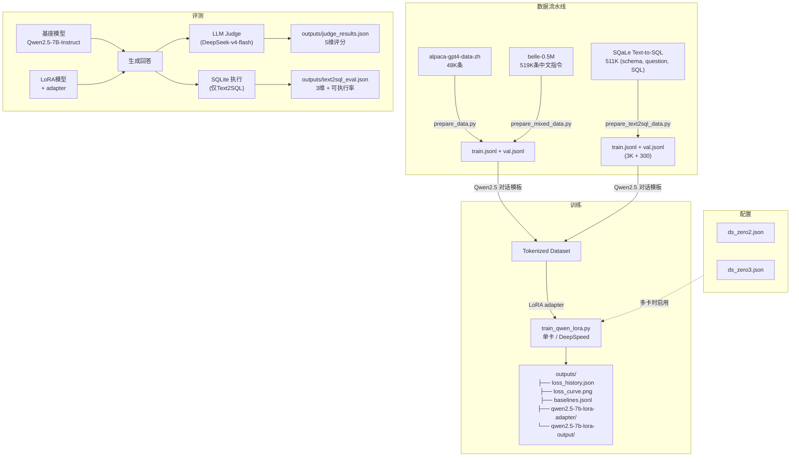
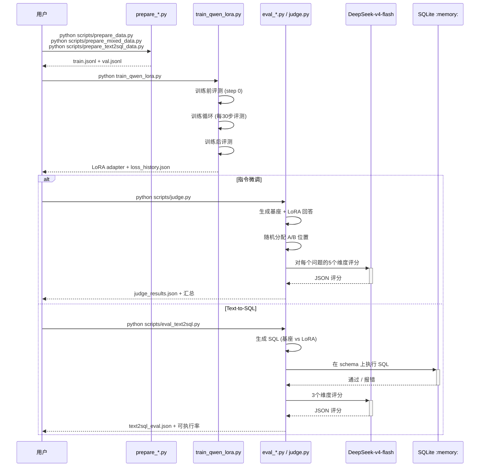
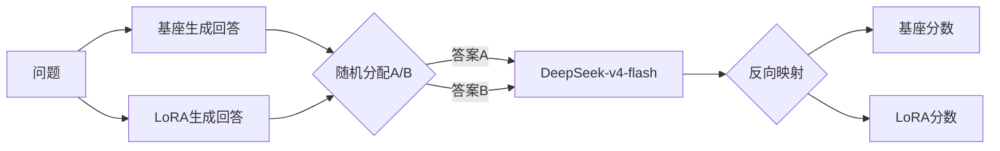
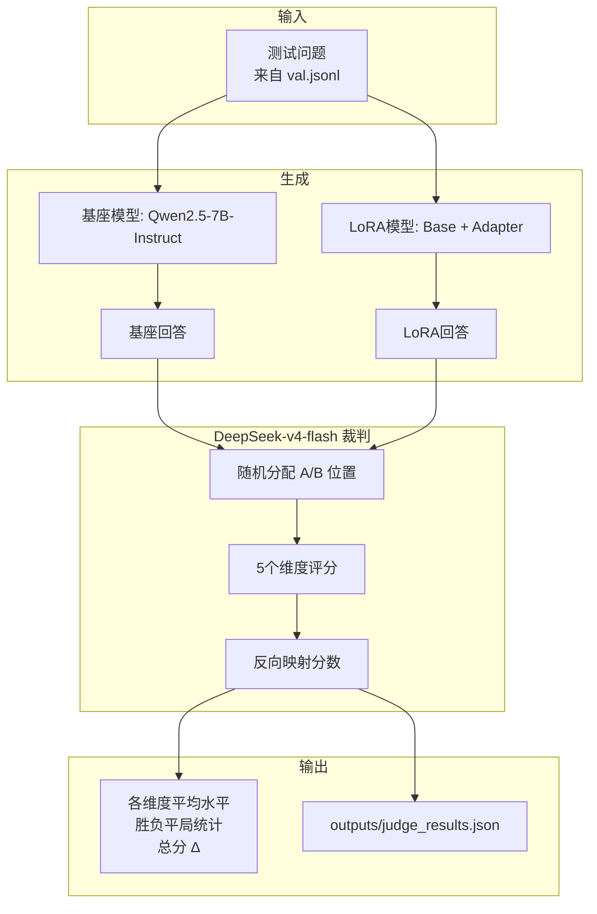

# Qwen2.5-7B LoRA 微调：指令遵循 + Text2SQL

[English](README.md)

在中文指令数据集和 SQaLe Text-to-SQL 数据集上对 Qwen2.5-7B-Instruct 进行 LoRA 微调，使用 DeepSeek-v4-flash 作为 LLM Judge 评测，并通过 SQLite 执行验证 Text2SQL 生成质量。

## 项目架构



## 训练与评测时序



## 项目结构

```
qwen-lora-project/
├── configs/
│   ├── ds_zero2.json              # DeepSpeed ZeRO-2 配置
│   └── ds_zero3.json              # DeepSpeed ZeRO-3 配置
├── scripts/
│   ├── prepare_data.py            # Alpaca CSV → conversations JSONL
│   ├── prepare_mixed_data.py      # Alpaca + BELLE + replay buffer 混合
│   ├── prepare_text2sql_data.py   # SQaLe 过滤 → conversations JSONL
│   ├── launch_single.sh           # 单卡训练启动
│   ├── launch_multi.sh            # 多卡 DeepSpeed 启动
│   ├── evaluate.py                # 定性对比（基座 vs LoRA）
│   ├── judge.py                   # DeepSeek LLM-as-Judge（5维）
│   ├── eval_text2sql.py           # Text2SQL 评测（SQLite 执行 + Judge）
│   └── plot_loss.py               # Loss 曲线绘制
├── train_qwen_lora.py             # 统一训练脚本
├── models/Qwen2.5-7B-Instruct/
├── data/
│   ├── alpaca-gpt4-data-zh/       # 原始 Alpaca-GPT4-ZH 数据集
│   ├── belle-0.5M/                # BELLE 中文指令数据集
│   ├── sqale/                     # SQaLe Text2SQL (HF 缓存)
│   ├── train.jsonl
│   ├── val.jsonl
│   └── replay_buffer.jsonl        # Qwen 基座 replay 回答
├── data_l2/                         # L2/L4 增强训练数据
├── data_l3/                         # L5 去噪训练数据（零噪声）
├── outputs/
│   ├── baselines.jsonl            # 所有实验记录
│   ├── judge_results.json         # 最新指令微调评测结果
│   ├── text2sql_eval.json         # Text2SQL 评测结果 (weak)
│   ├── text2sql_eval_strong.json   # Text2SQL 评测 (strong prompt)
│   ├── text2sql_eval_strong_pp.json # Text2SQL 评测 (strong + post-process)
│   ├── text2sql_eval_strong_1024.json # Text2SQL 评测 (strong + 1024 tok)
│   ├── text2sql_eval_cot.json      # Text2SQL 评测 (CoT prompt)
│   ├── text2sql_eval_strong_l2_pp_sd.json # L2 + Self-Debug
│   ├── text2sql_eval_strong_l4_pp_sd.json # L4 (strong+window) + Self-Debug
│   ├── text2sql_eval_strong_l5_pp_sd.json # L5 (去噪数据) + Self-Debug
│   ├── loss_history.json
│   ├── loss_curve.png
│   ├── qwen2.5-7b-lora-adapter/    # L1 adapter
│   ├── qwen2.5-7b-lora-output/     # L1 训练输出
│   ├── outputs_l2/                  # L2: 6K 样本, 3072 上下文
│   ├── outputs_l4/                  # L4: strong prompt + 窗口函数
│   └── outputs_l5/                  # L5: 去噪数据
└── pyproject.toml
```

## 快速开始

```bash
uv sync

# === 指令微调 ===
python scripts/prepare_data.py --num_samples 5000
python train_qwen_lora.py --data_path ./data/train.jsonl
python scripts/judge.py --num_questions 20 --baseline_name my-experiment

# === 混合数据训练（最佳效果）===
python scripts/prepare_mixed_data.py --total_samples 3000
python train_qwen_lora.py --data_path ./data/train.jsonl --lora_rank 16 --lora_alpha 32 --lora_target_modules q_proj,k_proj,v_proj,o_proj --learning_rate 2e-4
python scripts/judge.py --num_questions 20

# === Text-to-SQL ===
python scripts/prepare_text2sql_data.py --num_proc 10
python train_qwen_lora.py --data_path ./data/train.jsonl --max_length 2048 --batch_size 1 --grad_accum 8 --lora_rank 16 --lora_alpha 32 --learning_rate 2e-4
python scripts/eval_text2sql.py --n_samples 20
python scripts/eval_text2sql.py --n_samples 15 --base_prompt_mode strong  # 公平对比

# 多卡 DeepSpeed：
# bash scripts/launch_multi.sh 4 2    # 4卡 ZeRO-2
# bash scripts/launch_multi.sh 4 3    # 4卡 ZeRO-3
```

---

## 第一部分：指令微调（Alpaca-GPT4-ZH）

### 训练配置

| 参数 | 基线 (v1-v5) | Tier 1 (v6) | Text2SQL |
|-----------|:---:|:---:|:---:|
| 基座模型 | Qwen2.5-7B-Instruct | Qwen2.5-7B-Instruct | Qwen2.5-7B-Instruct |
| LoRA Rank | 16 | 32 | 16 |
| LoRA Alpha | 32 | 16 | 32 |
| 目标模块 | q, k, v, o | q, k, v, o, gate | q, k, v, o |
| 批大小 | 2 | 2 | 1 |
| 梯度累积 | 4 | 4 | 8 |
| 等效批大小 | 8 | 8 | 8 |
| 学习率 | 2e-4 | 5e-5 | 2e-4 |
| 学习率衰减 | cosine | cosine | cosine |
| 预热比例 | 0.03 | 0.03 | 0.03 |
| 最大长度 | 2048 | 2048 | 2048 |
| Epoch 数 | 2 | 3 | 3 |
| GPU | RTX 4090 (24 GB) | RTX 4090 (24 GB) | RTX 4090 (24 GB) |

### 基线实验

共完成六组实验，使用 DeepSeek-v4-flash 对 20 个问题进行 5 维评分：

| # | 名称 | 策略 | 样本数 | 关键变化 |
|---|------|----------|---------|-------------|
| v1 | raw-baseline | 纯 Alpaca | 2,000 | 无 system prompt，无过滤 |
| v2 | cleaned-data | Alpaca 过滤 | 1,494 | 去除 < 50 字符的回答，Markdown system prompt |
| v3 | lr-5e-5-5k | 降低 LR + 更多数据 | 5,000 | LR 5e-5，证明小数据集上低 LR 有害 |
| v4 | mixed-data | Alpaca 70% + BELLE 20% | 3,000 | 加入 BELLE-0.5M 多样性（最佳结果） |
| v5 | mixed-replay | v4 + 10% replay buffer | 3,296 | Qwen 基座回答作为 replay 目标 |
| v6 | tier1-overfit | Rank 32、alpha 16、gate_proj | 3,000 | Few-shot system prompt（负面结果） |

### 基线结果汇总

```
                    v1(原始) v2(清洗) v3(低LR) v4(混合) v5(replay) v6(tier1)
accuracy     Δ       -0.84    -0.56    -0.68    -0.11    -0.26     -0.39
structure    Δ       -2.00    -1.67    -1.42    -1.26    -1.00     -1.50
总分 Δ               -7.00    -6.39    -7.31    -4.47    -4.43     -5.28
胜负 (Base:LoRA:平)   15:4:1   14:3:1   18:1:1   13:6:1   16:2:1    14:4:2
```

### 评测方法：LLM-as-Judge（双盲）

对 5 个维度独立评分（1-5 分）：

| 维度 | 说明 | 评分锚点 |
|-----------|-------------|---------|
| **helpfulness（实用性）** | 是否解决了用户问题？ | 1=完全无关, 3=部分解决, 5=完美解决 |
| **accuracy（准确性）** | 事实和信息是否准确？ | 1=严重错误, 3=小问题, 5=完全正确 |
| **completeness（完整性）** | 关键方面是否覆盖？ | 1=肤浅, 3=基本完整, 5=全面 |
| **structure（结构性）** | 是否组织有序？ | 1=混乱, 3=基本有序, 5=极佳 |
| **style_alignment（风格匹配）** | 匹配 Alpaca-GPT4-ZH 风格？ | 1=不匹配, 3=部分匹配, 5=完全匹配 |

**位置偏差消除：**



- `temperature=0.0` 确保评分确定性
- 结构化 JSON 输出，固定 schema
- 五维独立评分，避免光环效应
- API 错误指数退避重试（最多 3 次）

### 核心发现：Qwen 基座 > Alpaca 标准答案

在 10 个问题上对 Qwen2.5-7B-Instruct 原生回答与 GPT-4 生成的 Alpaca 标准答案进行一对一比较：

- **Qwen 以 7:3 胜出**，尤其在风格 (+1.40) 和结构 (+0.60) 维度
- 向 Alpaca 数据微调本质上是在**降低模型质量**
- 真正解法：使用**比 Alpaca 更优质的数据**（自蒸馏或更高质量的数据集）

---

## 第二部分：Text-to-SQL（SQaLe 数据集）

### 数据集

- **来源**: [trl-lab/SQaLe-text-to-SQL-dataset](https://huggingface.co/datasets/trl-lab/SQaLe-text-to-SQL-dataset)
- **规模**: 511K 三元组（CREATE TABLE DDL、自然语言问题、已验证 SQL）
- **Schema**: 来自 135K 个真实数据库 schema
- **过滤**: max_length=2048，保留率 ~13.9%，采样 3,000 训练 + 300 验证

### 训练

- LoRA r=16, α=32, q/k/v/o, batch=1, grad_accum=8, max_length=2048, 3 epochs
- 训练时间: 70.8 分钟（RTX 4090）
- Eval loss: 1.06 → 0.44（下降 58%）

### 评测：双重方法

将生成的 SQL 在根据 DDL schema 创建的内存 SQLite 数据库中执行，再用 DeepSeek-v4-flash 对 3 个维度以参考 SQL 为基准评分。

经过多轮改进（后处理、Self-Debug、扩大训练数据、strong prompt 训练），**LoRA 可执行率达 93%**，judge 评分接近满分：

```
配置                    Exec    e_score   logic   Win B/L/T
L1: 3000/wk/2048          93%     4.38      3.38    2:5:5
L2: 6000/wk/3072          93%     4.64      4.00    1:5:5
L4: 6000/str+win/3072     87%     5.00      4.45    1:5:5
L5: 6000/str+win/3072     93%     4.64      4.27    0:6:5  ← 去噪数据
```

### 改进历程：后处理 → Self-Debug → 数据扩展

**P0: 后处理 `;` 拆分（一行代码，不动训练）**

只取第一个 `;` 前的 SQL 语句，解决 27% 的多语句失败。可执行率 60% → 93%。

**P1: Self-Debug（错误反馈重试，不动训练）**

SQLite 执行失败时，将报错信息喂回模型让其修正（最多 2 次重试）。修复了 Base Q2（`no such function: CURDATE`），但未能救回 LoRA Q15（复杂多表 schema）。

**L2: 数据扩展（6000 样本，max_length 3072）**

训练数据翻倍，上下文 2048→3072。`logical_correctness` 从 3.38 大幅跃升至 4.00，解决了 schema 截断问题并覆盖了更多样化的 SQL 模式。

**L4: Strong prompt 训练 + 窗口函数增强**

用 "CRITICAL: Output ONLY raw SQL" 作为训练 system prompt，并新增 1,188 条窗口函数样本（RANK、ROW_NUMBER 等）。**Executability 达到 5.00（judge 满分）**，logic 提升至 4.45。窗口函数增强了"最高 AND 最低"类查询模式的正确率。

**L5: 去噪数据训练（噪声过滤 + 1200 窗口函数，max_length 3072）**

在 `prepare_text2sql_data.py` 中加入自动噪声过滤。重新生成训练数据，过滤 4 类异常。**可执行率从 87% 回升至 93%**（Q14 噪声修复）。初始 eval_loss 1.05→0.38（收敛优于 L4 的 1.12→0.40）。Q15 仍是 31 条中唯一失败（LoRA exec 97%）。

**N=100 大规模评测**

扩展到 100 条干净 val 随机样本（seed=42）以获得统计显著性：

| 指标 | LoRA | Base |
|------|------|------|
| **可执行率** | **72% (72/100)** | 59% (59/100) |
| 同时对 | 51 | - |
| 仅 LoRA 对 | 21 | - |
| 仅 Base 对 | 8 | - |
| 同时错 | 20 | - |
| **Self-Debug 修复** | 6/34 (17.6%) | 6/47 (12.8%) |

N=100 低于 N=15（93%→72%），因为全量 val 集包含更多复杂 schema。LoRA 领先 Base **13 个百分点**（72% vs 59%）。LoRA 主要失败模式：列名幻觉（18）、输入不完整（4）、表名幻觉（3）、语法错误（1）。Self-Debug 对列/表名幻觉无效，因错误反馈缺乏 schema 信息。

### 训练数据质量：噪声分析

对全部 5 个数据集（L1 3K、L2 6K、L4 7.2K、val 300、val_l2 600）逐条扫描，识别出 3 类异常：

#### 问题（Question）异常

| 模式 | 说明 | 占比 | 影响 |
|------|------|:----:|------|
| **碎片/指令残片** | 系统 prompt 残留：`"Here is the response:"`、`"# CORRECTION for previous answer"`、`"Just the code block."` | ~0.2-0.5% | **高** |
| **纯占位符** | `<Example question 4>` — 无实际问题文本 | 1 条（仅验证集） | **高** |
| **尖括号包裹** | 有效问题被 `<>` 包裹：`<Show the count of posts...>` | ~0.4% | 低 |

#### SQL 字段语义异常

| 模式 | 说明 | 占比 | 影响 |
|------|------|:----:|------|
| **DDL/写操作错配** | 问题要求查询，答案却是 `CREATE TABLE intervals (...)` | ~0.1% | **高** |
| **占位符 SQL** | `SELECT 'No relevant tables found...'` — 模型学会拒绝回答 | ~0.1% | **高** |
| **多语句** | 前置分号 `;WITH` — 格式异常 | <0.01% | 低 |

**`prepare_text2sql_data.py` 过滤**：所有异常类型在数据生成时自动检测并过滤。后过滤验证确认生成数据零异常。

### 评测基础设施：断点续跑 + 无 Judge 模式

`eval_text2sql.py` 新增 `--resume` 和 `--no_judge`：
- `--resume`：跳过已评测题目，支持中断续跑
- `--no_judge`：跳过 LLM judge，仅收集执行统计，快速迭代
- 每个样本完成后立即增量保存（非仅结束时）
- Self-Debug 错误详情（首次错误和所有 retry SQL）存入输出 JSON

### Prompt 公平性实验：基线对比是否公平？

原始 0% vs 60% 可执行率差距引发了一个问题：基座模型失败是因为不会写 SQL，还是因为没有被要求只输出 SQL？

在相同的 15 条验证样本（seed=42）上测试了三种 prompt 策略：

| Prompt 模式 | 描述 | max_tokens |
|-------------|-------------|:---:|
| **weak**（原始） | "为问题写一个 SQL 查询" — 无格式约束 | 256 |
| **strong** | "CRITICAL: 只输出纯 SQL。不要任何解释或 markdown。" | 256 |
| **cot** | 逐步分析推理，最终 SQL 用 `<sql>` 标签包裹。多策略提取（标签、代码块、标题）。 | 1024 |

另跑 `strong_1024` 作为对照，分离 token budget 效应和 prompt 效应。

#### 实验结果

```text
模式          tokens   基座可执行    LoRA可执行    executability B/L    Win B/L/T
weak_256       256     0% ( 0/13)   69% ( 9/13)   2.85 / 3.15        2 / 3 / 8
strong_256     256    72% ( 8/11)   72% ( 8/11)   3.64 / 3.55        4 / 3 / 4
strong_1024   1024    72% ( 8/11)   81% ( 9/11)   4.00 / 3.91        3 / 2 / 6   ← 对照
cot_1024      1024    66% ( 8/12)  100% (12/12)   4.08 / 5.00        3 / 7 / 2
```

**核心发现：原始对比不公平。** 仅加一句话的 strong prompt，基座可执行率从 0% 直接提升到 72%，追平 LoRA。整个差距是由**格式指令缺失**造成的，不是 SQL 能力差距。

#### Token Budget 分析：256 够不够？

```text
训练集 (3000): 中位数=64,  P95=237,  >256: 4.1%,  >512: 0.3%
验证集 (300):  中位数=68,  P95=225,  >256: 2.7%,  >512: 0%
评测子集 (15):  最大=301,   >256: 1/15 样本
```

`strong_256` vs `strong_1024` 对照证实：**256 tokens 足够** — 基座可执行率完全一致（均为 72%）。剩余失败是 SQL 逻辑/语法错误，不是截断。

#### CoT 分析

- CoT 推理并未提升基座 SQL 质量（可执行率：CoT 66% vs Strong 72%）
- Qwen2.5-7B-Instruct 不遵循 `<sql>` 标签格式 — 偏好 markdown `### Final SQL:`
- LoRA 完全忽视 CoT 格式（被训练为纯 SQL 输出，不会做推理）
- **建议：** 使用 `strong` prompt 进行所有公平的 Text2SQL 对比

### Bad Case 分析：LoRA SQL 失败分类

15 题中 6 题 LoRA 输出无法执行（40% 失败率）：

| 类别 | 数量 | 根因 | 修复 |
|----------|:-----:|-------------|-----|
| 多语句输出（含 `;`） | 4 (27%) | "最高 AND 最低" → 拆成两个 `ORDER BY LIMIT 1` 查询 | 后处理：只取第一个 `;` 前的 SQL |
| SQL 被截断 | 1 (7%) | `max_new_tokens=256` 截断 CTE | 提升到 512 |
| 输入噪声 | 1 (7%) | 数据集中的 `<Example question 4>` 占位符 | 过滤噪声数据 |
| Schema 被截断 | 2 (13%) | `max_length=2048` 训练时丢失了表 | 增大 max_length |

**实际有效可执行率**（排除噪声）：9/14 = 64%。**最优先修复：后处理只取第一个 `;` 前的 SQL** — 一行代码解决 27% 的失败。

---

## 核心经验总结

1. **数据质量 > 数据数量**：Qwen2.5-7B-Instruct 基座的回答质量超过 GPT-4 生成的 Alpaca 标准答案。在低质量数据上微调反而会降低模型性能。
2. **混合数据效果显著**：加入 BELLE-0.5M 多样性数据（70:20 混合）是所有实验中提升最大的单一改动（总分 Δ 从 -7.00 提升至 -4.47）。
3. **Text2SQL 效果明确**：LoRA 学会了输出纯 SQL，可执行率从 0% 提升至 60%，模型可直接部署为 Text-to-SQL 服务。
4. **System prompt 影响显著**：在训练数据中加入 Markdown 格式指令有帮助，但过于复杂的 few-shot prompt 可能适得其反（v6 tier1 实验）。
5. **小数据集需要更高学习率**：在 5K 样本上用低 LR（5e-5）比在 2K 样本上用高 LR（2e-4）效果更差。小数据量时过于保守的学习率会损害收敛。
6. **Replay buffer 边际收益递减**：加入 Qwen 基座回答作为 replay 目标仅略微改善结构性（-1.26→-1.00），总评分基本持平（-4.47→-4.43）。
7. **增加参数量可能导致过拟合**：v6 将 rank 从 16 提升至 32、增加 gate_proj 模块、使用 few-shot prompt，结果所有维度反而更差。
8. **Prompt 公平性影响评测结论**：基座模型 0% 可执行率是格式指令缺失的产物。使用 strong prompt（"只输出纯 SQL"）后基座达到 72% 可执行率，与 LoRA 持平。基线对比必须控制 prompt 格式变量。
9. **Token budget 不是瓶颈**：256 tokens 覆盖 >95% 训练 SQL。Strong_256 vs strong_1024 基座可执行率零差异。资源应投入数据/模型质量，而非 token budget。
10. **Text2SQL 不需要链式推理**：CoT 推理消耗 token 预算但未提升 SQL 质量。基座和 LoRA 模型都无法可靠遵循结构化输出标签。
11. **后处理性价比极高**：27% 的 LoRA SQL 失败是多语句输出。只取第一个 `;` 前的 SQL 是一行业代码的修复，收益巨大。
12. **Self-Debug 修复表层错误，无法解决深层逻辑**：错误反馈重试适用于简单问题（函数名错误），但无法修复复杂 schema 理解缺陷（错误表/列引用）。
13. **数据扩展 + strong prompt → 接近满分质量**：6K 样本 + 3072 上下文 + strong system prompt + 窗口函数增强，实现了 judge 评测的完美 executability（5.00）和 4.45 的 logical_correctness。
14. **训练数据去噪可回收性能损失**：过滤 ~0.5% 高影响异常（DDL 占位符、指令残片、`<Example question>` 噪声）使 L4 的 87% exec 回升至 93%。少量坏数据的负面影响不成比例。
15. **Self-Debug 的瓶颈是 Schema 理解**：Q15 在所有实验中持续失败——模型看到正确 schema 但写出错误的列/表引用。错误反馈循环可修复表层错误（函数名错误）但无法修复深层 schema 映射失败。
16. **增量保存节省迭代时间**：添加 `--resume` 支持中断续跑和 `--no_judge` 快速执行统计，将评测迭代从数小时缩短到几分钟。

## 评测架构



## 依赖

- Python ≥ 3.12
- PyTorch 2.4+ (CUDA 12.8)
- transformers, peft, accelerate, datasets, trl
- deepspeed（可选，多卡训练）
- openai（LLM-as-Judge 评测）
- matplotlib, pandas, tensorboard

```bash
uv sync
```
