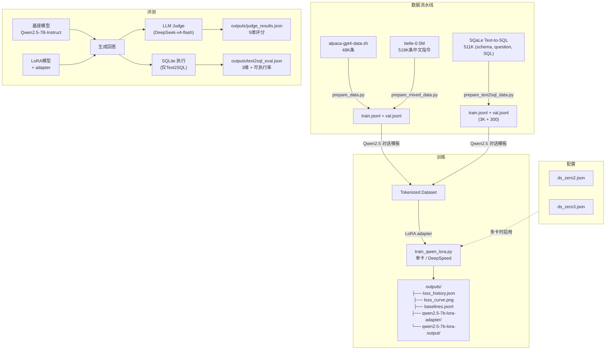
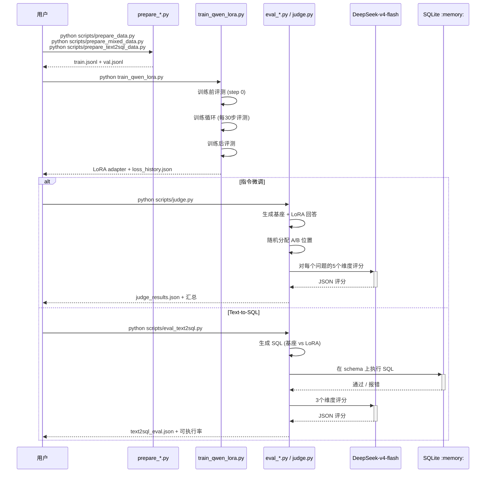
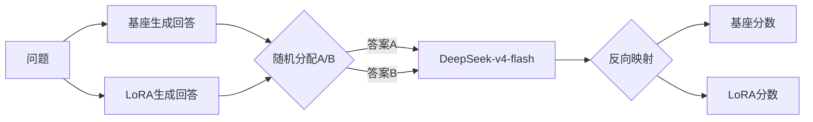
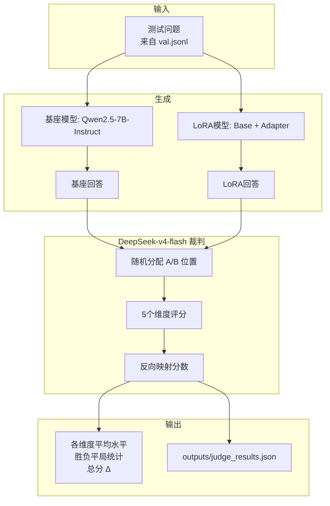

# Qwen2.5-7B LoRA 微调：指令遵循 + Text2SQL

[English](README.md)

在中文指令数据集和 SQaLe Text-to-SQL 数据集上对 Qwen2.5-7B-Instruct 进行 LoRA 微调，使用 DeepSeek-v4-flash 作为 LLM Judge 评测，并通过 SQLite 执行验证 Text2SQL 生成质量。

## 项目架构



## 训练与评测时序



## 项目结构

```
qwen-lora-project/
├── configs/
│   ├── ds_zero2.json              # DeepSpeed ZeRO-2 配置
│   └── ds_zero3.json              # DeepSpeed ZeRO-3 配置
├── scripts/
│   ├── prepare_data.py            # Alpaca CSV → conversations JSONL
│   ├── prepare_mixed_data.py      # Alpaca + BELLE + replay buffer 混合
│   ├── prepare_text2sql_data.py   # SQaLe 过滤 → conversations JSONL
│   ├── launch_single.sh           # 单卡训练启动
│   ├── launch_multi.sh            # 多卡 DeepSpeed 启动
│   ├── evaluate.py                # 定性对比（基座 vs LoRA）
│   ├── judge.py                   # DeepSeek LLM-as-Judge（5维）
│   ├── eval_text2sql.py           # Text2SQL 评测（SQLite 执行 + Judge）
│   └── plot_loss.py               # Loss 曲线绘制
├── train_qwen_lora.py             # 统一训练脚本
├── models/Qwen2.5-7B-Instruct/
├── data/
│   ├── alpaca-gpt4-data-zh/       # 原始 Alpaca-GPT4-ZH 数据集
│   ├── belle-0.5M/                # BELLE 中文指令数据集
│   ├── sqale/                     # SQaLe Text2SQL (HF 缓存)
│   ├── train.jsonl
│   ├── val.jsonl
│   └── replay_buffer.jsonl        # Qwen 基座 replay 回答
├── outputs/
│   ├── baselines.jsonl            # 所有实验记录
│   ├── judge_results.json         # 最新指令微调评测结果
│   ├── text2sql_eval.json         # Text2SQL 评测结果
│   ├── loss_history.json
│   ├── loss_curve.png
│   ├── qwen2.5-7b-lora-adapter/
│   └── qwen2.5-7b-lora-output/
└── pyproject.toml
```

## 快速开始

```bash
uv sync

# === 指令微调 ===
python scripts/prepare_data.py --num_samples 5000
python train_qwen_lora.py --data_path ./data/train.jsonl
python scripts/judge.py --num_questions 20 --baseline_name my-experiment

# === 混合数据训练（最佳效果）===
python scripts/prepare_mixed_data.py --total_samples 3000
python train_qwen_lora.py --data_path ./data/train.jsonl --lora_rank 16 --lora_alpha 32 --lora_target_modules q_proj,k_proj,v_proj,o_proj --learning_rate 2e-4
python scripts/judge.py --num_questions 20

# === Text-to-SQL ===
python scripts/prepare_text2sql_data.py --num_proc 10
python train_qwen_lora.py --data_path ./data/train.jsonl --max_length 2048 --batch_size 1 --grad_accum 8 --lora_rank 16 --lora_alpha 32 --learning_rate 2e-4
python scripts/eval_text2sql.py --n_samples 20

# 多卡 DeepSpeed：
# bash scripts/launch_multi.sh 4 2    # 4卡 ZeRO-2
# bash scripts/launch_multi.sh 4 3    # 4卡 ZeRO-3
```

---

## 第一部分：指令微调（Alpaca-GPT4-ZH）

### 训练配置

| 参数 | 基线 (v1-v5) | Tier 1 (v6) | Text2SQL |
|-----------|:---:|:---:|:---:|
| 基座模型 | Qwen2.5-7B-Instruct | Qwen2.5-7B-Instruct | Qwen2.5-7B-Instruct |
| LoRA Rank | 16 | 32 | 16 |
| LoRA Alpha | 32 | 16 | 32 |
| 目标模块 | q, k, v, o | q, k, v, o, gate | q, k, v, o |
| 批大小 | 2 | 2 | 1 |
| 梯度累积 | 4 | 4 | 8 |
| 等效批大小 | 8 | 8 | 8 |
| 学习率 | 2e-4 | 5e-5 | 2e-4 |
| 学习率衰减 | cosine | cosine | cosine |
| 预热比例 | 0.03 | 0.03 | 0.03 |
| 最大长度 | 2048 | 2048 | 2048 |
| Epoch 数 | 2 | 3 | 3 |
| GPU | RTX 4090 (24 GB) | RTX 4090 (24 GB) | RTX 4090 (24 GB) |

### 基线实验

共完成六组实验，使用 DeepSeek-v4-flash 对 20 个问题进行 5 维评分：

| # | 名称 | 策略 | 样本数 | 关键变化 |
|---|------|----------|---------|-------------|
| v1 | raw-baseline | 纯 Alpaca | 2,000 | 无 system prompt，无过滤 |
| v2 | cleaned-data | Alpaca 过滤 | 1,494 | 去除 < 50 字符的回答，Markdown system prompt |
| v3 | lr-5e-5-5k | 降低 LR + 更多数据 | 5,000 | LR 5e-5，证明小数据集上低 LR 有害 |
| v4 | mixed-data | Alpaca 70% + BELLE 20% | 3,000 | 加入 BELLE-0.5M 多样性（最佳结果） |
| v5 | mixed-replay | v4 + 10% replay buffer | 3,296 | Qwen 基座回答作为 replay 目标 |
| v6 | tier1-overfit | Rank 32、alpha 16、gate_proj | 3,000 | Few-shot system prompt（负面结果） |

### 基线结果汇总

```
                    v1(原始) v2(清洗) v3(低LR) v4(混合) v5(replay) v6(tier1)
accuracy     Δ       -0.84    -0.56    -0.68    -0.11    -0.26     -0.39
structure    Δ       -2.00    -1.67    -1.42    -1.26    -1.00     -1.50
总分 Δ               -7.00    -6.39    -7.31    -4.47    -4.43     -5.28
胜负 (Base:LoRA:平)   15:4:1   14:3:1   18:1:1   13:6:1   16:2:1    14:4:2
```

### 评测方法：LLM-as-Judge（双盲）

对 5 个维度独立评分（1-5 分）：

| 维度 | 说明 | 评分锚点 |
|-----------|-------------|---------|
| **helpfulness（实用性）** | 是否解决了用户问题？ | 1=完全无关, 3=部分解决, 5=完美解决 |
| **accuracy（准确性）** | 事实和信息是否准确？ | 1=严重错误, 3=小问题, 5=完全正确 |
| **completeness（完整性）** | 关键方面是否覆盖？ | 1=肤浅, 3=基本完整, 5=全面 |
| **structure（结构性）** | 是否组织有序？ | 1=混乱, 3=基本有序, 5=极佳 |
| **style_alignment（风格匹配）** | 匹配 Alpaca-GPT4-ZH 风格？ | 1=不匹配, 3=部分匹配, 5=完全匹配 |

**位置偏差消除：**



- `temperature=0.0` 确保评分确定性
- 结构化 JSON 输出，固定 schema
- 五维独立评分，避免光环效应
- API 错误指数退避重试（最多 3 次）

### 核心发现：Qwen 基座 > Alpaca 标准答案

在 10 个问题上对 Qwen2.5-7B-Instruct 原生回答与 GPT-4 生成的 Alpaca 标准答案进行一对一比较：

- **Qwen 以 7:3 胜出**，尤其在风格 (+1.40) 和结构 (+0.60) 维度
- 向 Alpaca 数据微调本质上是在**降低模型质量**
- 真正解法：使用**比 Alpaca 更优质的数据**（自蒸馏或更高质量的数据集）

---

## 第二部分：Text-to-SQL（SQaLe 数据集）

### 数据集

- **来源**: [trl-lab/SQaLe-text-to-SQL-dataset](https://huggingface.co/datasets/trl-lab/SQaLe-text-to-SQL-dataset)
- **规模**: 511K 三元组（CREATE TABLE DDL、自然语言问题、已验证 SQL）
- **Schema**: 来自 135K 个真实数据库 schema
- **过滤**: max_length=2048，保留率 ~13.9%，采样 3,000 训练 + 300 验证

### 训练

- LoRA r=16, α=32, q/k/v/o, batch=1, grad_accum=8, max_length=2048, 3 epochs
- 训练时间: 70.8 分钟（RTX 4090）
- Eval loss: 1.06 → 0.44（下降 58%）

### 评测：双重方法

**1. SQLite 执行（客观指标）：**

将生成的 SQL 在根据 DDL schema 创建的内存 SQLite 数据库中执行：

```
基座模型: 0% 可执行  （输出解释性文本 + Markdown 包裹的 SQL）
LoRA模型: 60% 可执行 （学会输出纯 SQL）
```

**2. DeepSeek Judge（主观评测）：**

以参考 SQL 为基准的三维评分：

```
维度                   基座    LoRA    Δ
executability            --      --   +0.31
logical_correctness      --      --   +0.23
conciseness              --      --   +0.23
胜负: Base=2, LoRA=3, 平局=8 / 13题
```

---

## 核心经验总结

1. **数据质量 > 数据数量**：Qwen2.5-7B-Instruct 基座的回答质量超过 GPT-4 生成的 Alpaca 标准答案。在低质量数据上微调反而会降低模型性能。
2. **混合数据效果显著**：加入 BELLE-0.5M 多样性数据（70:20 混合）是所有实验中提升最大的单一改动（总分 Δ 从 -7.00 提升至 -4.47）。
3. **Text2SQL 效果明确**：LoRA 学会了输出纯 SQL，可执行率从 0% 提升至 60%，模型可直接部署为 Text-to-SQL 服务。
4. **System prompt 影响显著**：在训练数据中加入 Markdown 格式指令有帮助，但过于复杂的 few-shot prompt 可能适得其反（v6 tier1 实验）。
5. **小数据集需要更高学习率**：在 5K 样本上用低 LR（5e-5）比在 2K 样本上用高 LR（2e-4）效果更差。小数据量时过于保守的学习率会损害收敛。
6. **Replay buffer 边际收益递减**：加入 Qwen 基座回答作为 replay 目标仅略微改善结构性（-1.26→-1.00），总评分基本持平（-4.47→-4.43）。
7. **增加参数量可能导致过拟合**：v6 将 rank 从 16 提升至 32、增加 gate_proj 模块、使用 few-shot prompt，结果所有维度反而更差。

## 评测架构



## 依赖

- Python ≥ 3.12
- PyTorch 2.4+ (CUDA 12.8)
- transformers, peft, accelerate, datasets, trl
- deepspeed（可选，多卡训练）
- openai（LLM-as-Judge 评测）
- matplotlib, pandas, tensorboard

```bash
uv sync
```
