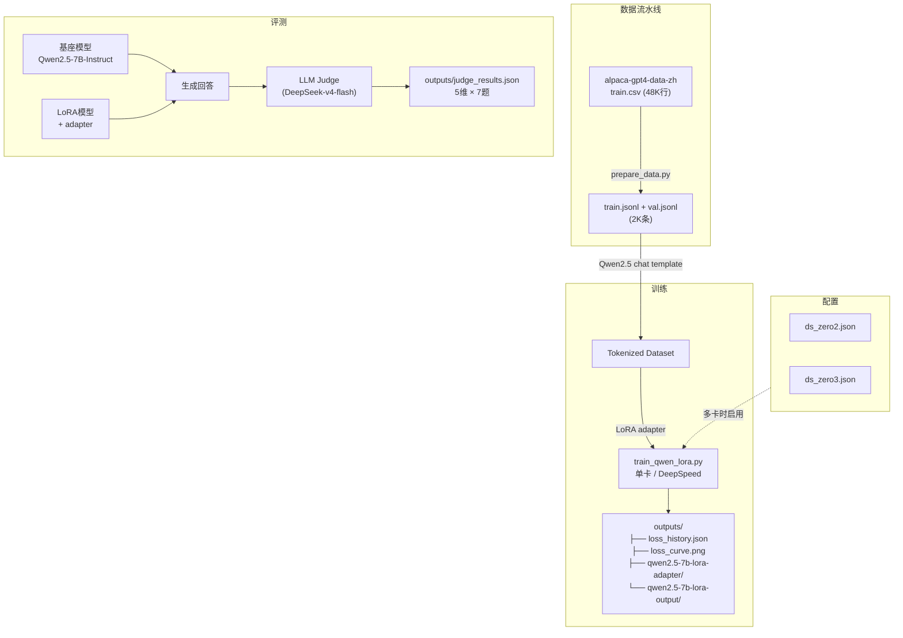
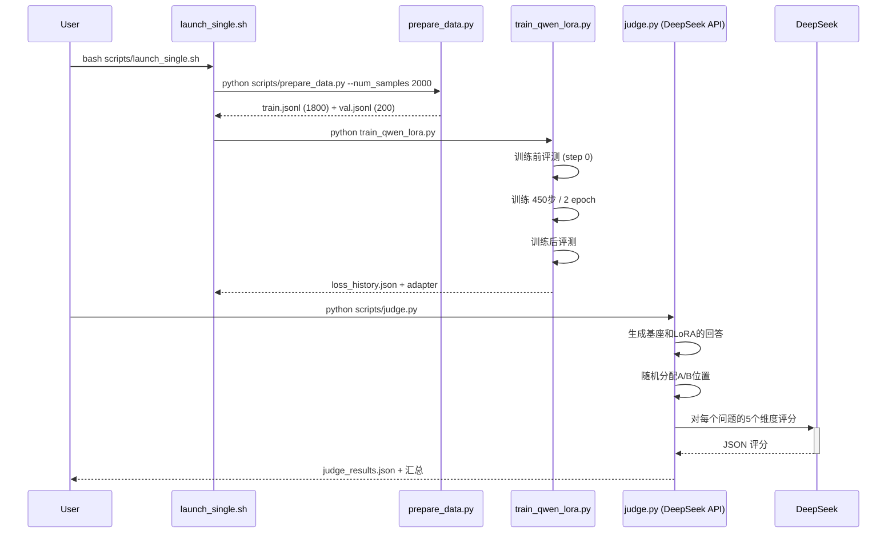
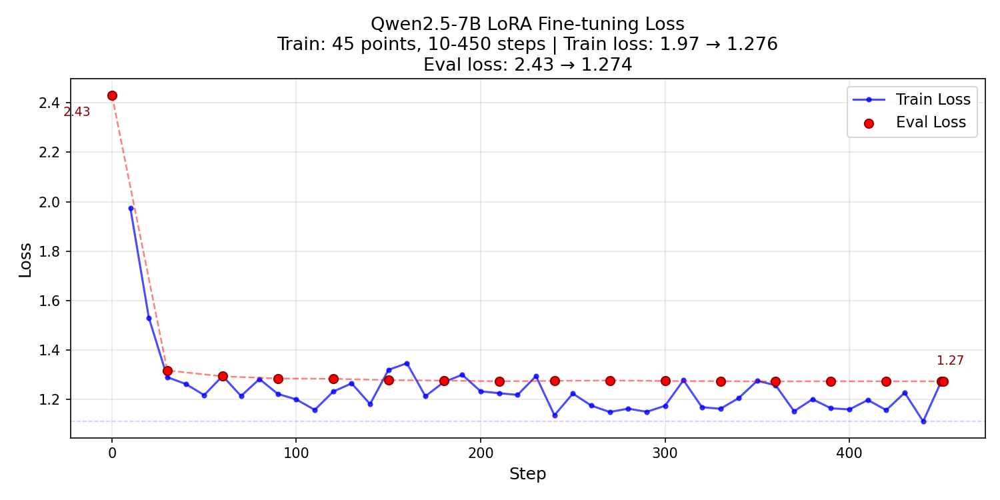
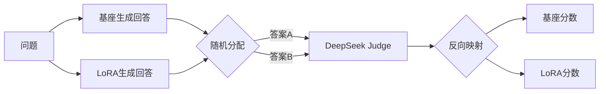

# Qwen2.5-7B LoRA 微调与评测

[English](README.md)

在中文指令数据集（Alpaca-GPT4-ZH）上对 Qwen2.5-7B-Instruct 进行 LoRA 微调，并使用 DeepSeek-v4-flash 作为 LLM Judge 评测。

## 项目架构



## 训练与评测时序



## 项目结构

```
qwen-lora-project/
├── configs/
│   ├── ds_zero2.json              # DeepSpeed ZeRO-2 配置
│   └── ds_zero3.json              # DeepSpeed ZeRO-3 配置
├── scripts/
│   ├── prepare_data.py            # CSV → conversations JSONL
│   ├── launch_single.sh           # 单卡训练启动
│   ├── launch_multi.sh            # 多卡 DeepSpeed 启动
│   ├── evaluate.py                # 定性对比（基座 vs LoRA）
│   ├── judge.py                   # DeepSeek LLM Judge 评测
│   └── plot_loss.py               # Loss 曲线绘制
├── train_qwen_lora.py             # 统一训练脚本
├── models/
│   └── Qwen2.5-7B-Instruct/      # 基座模型 (~15 GB)
├── data/
│   ├── alpaca-gpt4-data-zh/      # 原始 Alpaca-GPT4-ZH 数据集
│   ├── train.jsonl                # 训练对话
│   └── val.jsonl                  # 验证对话
├── outputs/
│   ├── loss_history.json          # 全部 loss 数据 (JSON)
│   ├── loss_curve.png             # Loss 曲线图
│   ├── qwen2.5-7b-lora-adapter/  # LoRA 权重 (~50 MB)
│   ├── qwen2.5-7b-lora-output/   # 训练 checkpoint
│   └── judge_results.json         # Judge 评测结果
└── pyproject.toml
```

## 快速开始

```bash
# 1. 安装依赖
uv sync

# 2. 准备数据 + 训练（单卡）
bash scripts/launch_single.sh

# 3. LLM Judge 评测
python scripts/judge.py

# 4. 绘制 Loss 曲线
python scripts/plot_loss.py

# 5. 定性对比（无需外部 API）
python scripts/evaluate.py

# 多卡 DeepSpeed（未来使用）：
# bash scripts/launch_multi.sh 4 2    # 4卡 ZeRO-2
# bash scripts/launch_multi.sh 4 3    # 4卡 ZeRO-3
```

## 训练方法

| 参数 | 值 |
|-----------|-------|
| 基座模型 | Qwen2.5-7B-Instruct |
| 数据集 | Alpaca-GPT4-ZH（中文指令遵循） |
| 训练样本 | 2,000（1,800 训练 / 200 验证） |
| LoRA Rank | 16 |
| LoRA Alpha | 32（scale = 2.0） |
| 目标模块 | q_proj, k_proj, v_proj, o_proj（仅注意力层） |
| 可训练参数 | ~12.5M（7.6B 的 0.16%） |
| 批大小 | 2 per GPU × 4 grad accum = 等效 8 |
| Epoch 数 | 2 |
| 学习率 | 2e-4，余弦衰减 |
| 最大序列长度 | 2048 |
| 混合精度 | BF16 |
| 梯度检查点 | 开启 |
| GPU | 单张 RTX 4090（24 GB） |
| 训练时间 | ~8 分钟 |

### 核心设计决策

- **仅注意力层 LoRA**（q/k/v/o）：参数从 40M 降至 ~12.5M，更适合 2K 条样本
- **训练中验证**：每 30 步评测一次，训练前后强制各测一次
- **单卡模式**：直接用 `python` 启动，无需 DeepSpeed launcher
- **多卡就绪**：传入 `--deepspeed_config` 即可切换 ZeRO-2/3
- **Loss 数据导出**：自动导出到 `loss_history.json`，供画图和进一步分析

## 训练结果

```
Train Loss:  1.97 → 1.28  (45个记录点，每10步记录)
Eval Loss:   2.43 → 1.27  (17个点，每30步 + 训练前后)
训练时间: 8.1 分钟
显存占用: ~18 GB / 24 GB
```



### 分析

- **Eval loss 下降 47%**（2.43 → 1.27）：模型有效适配了 Alpaca-GPT4-ZH 的数据分布
- **Train-eval 差距**：收敛时 1.28 vs 1.27 — 无明显过拟合
- **稳定收敛**：eval loss 从 step 0 到 step 450 单调下降

## 评测方法

### LLM-as-Judge 双盲评测（DeepSeek-v4-flash）

使用外部 LLM 作为裁判，对模型输出在 5 个维度上评分：

| 维度 | 说明 | 1-3-5 分锚点 |
|-----------|-------------|---------------|
| **helpfulness（实用性）** | 回答是否解决了用户问题？ | 1=完全无关, 3=部分解决, 5=完美解决 |
| **accuracy（准确性）** | 事实和信息是否准确？ | 1=严重错误, 3=小问题, 5=完全正确 |
| **completeness（完整性）** | 关键方面是否覆盖？ | 1=肤浅, 3=基本完整, 5=全面 |
| **structure（结构性）** | 回答是否组织有序？ | 1=混乱, 3=基本有序, 5=极佳 |
| **style_alignment（风格匹配）** | 是否匹配 Alpaca-GPT4-ZH 风格？ | 1=不匹配, 3=部分匹配, 5=完全匹配 |

### 位置偏差消除



- 每个问题的 Base 和 LoRA 输出被**随机分配到"答案 A"或"答案 B"**
- Judge 评分时不知道哪个是哪个
- 评分完成后反向映射回真实标签
- 任何"偏好 A 位置"的倾向都会被均匀分布在两个模型之间

### 稳定性保障

- `temperature=0.0` 确保评分可复现
- 结构化 JSON 输出格式，固定 schema
- 五维独立评分，避免光环效应（halo effect）
- 7 个问题取平均，平滑单题噪音
- API 错误指数退避重试（最多 3 次）

## 评测结果

```
│ 维度               │  基座   │  LoRA   │  变化   │
│──────────────────────────────────────────────────│
│ helpfulness        │   3.57  │   3.57  │  +0.00  │
│ accuracy           │   4.43  │   3.86  │  -0.57  │
│ completeness       │   3.14  │   3.57  │  +0.43  │
│ structure          │   4.29  │   3.29  │  -1.00  │
│ style_alignment    │   4.00  │   3.14  │  -0.86  │
│──────────────────────────────────────────────────│
│ 平均总分差 (LoRA-基座)               │  -0.40  │
```

```
胜出次数: 基座 5, LoRA 2, 平局 0 / 7 题
```

### 分析

- **LoRA 提升了完整性 (+0.43)**：回答更详尽，更接近 Alpaca-GPT4-ZH 的详细风格
- **LoRA 降低了准确性 (-0.57)**：微调后偶尔引入小错误（如《水浒传》作者标注错误）
- **LoRA 丢失了结构性 (-1.00)**：基座模型使用 Markdown 格式（加粗、标题），LoRA 输出为纯数字列表
- **总体结论**：2,000 条 + attention-only LoRA 确实提升了回答完整度，但 Qwen2.5-7B-Instruct 基座质量已经很高，少量数据难以全面超越

## 未来提升方向

### 训练

| 改进方向 | 预期收益 |
|-------------|-----------------|
| 增加数据量至 5K-10K 条 | 更强的风格迁移信号 |
| 降低学习率（1e-4） | 更平稳的收敛和泛化 |
| 训练数据中加入 system prompt | 更好地控制输出风格 |
| QLoRA（4-bit 量化） | 显存减少 4 倍，支持更大 batch |
| 多轮对话数据 | 更真实的对话训练 |
| 数据质量过滤 | 去除噪声/过短样本 |

### 评测

| 改进方向 | 预期收益 |
|-------------|-----------------|
| 更大测试集（50+题） | 统计显著性更高 |
| 多次 Judge 取平均 | 评分稳定性更高 |
| 增加多样性指标（Distinct-N, Self-BLEU） | 检测内容记忆/过拟合 |
| 用 GPT-4 作参考答案基线 | 校准 Judge 评分标准 |
| 人工抽查验证 | 地面真相校验 |
| 配对胜率替代绝对分数 | 更鲁棒的比较指标 |

### 部署（P0 路线图）

1. 合并 LoRA + 转换 GGUF Q4_K_M
2. llama.cpp server + TTFT 测量
3. vLLM 部署 + 并发吞吐测试
